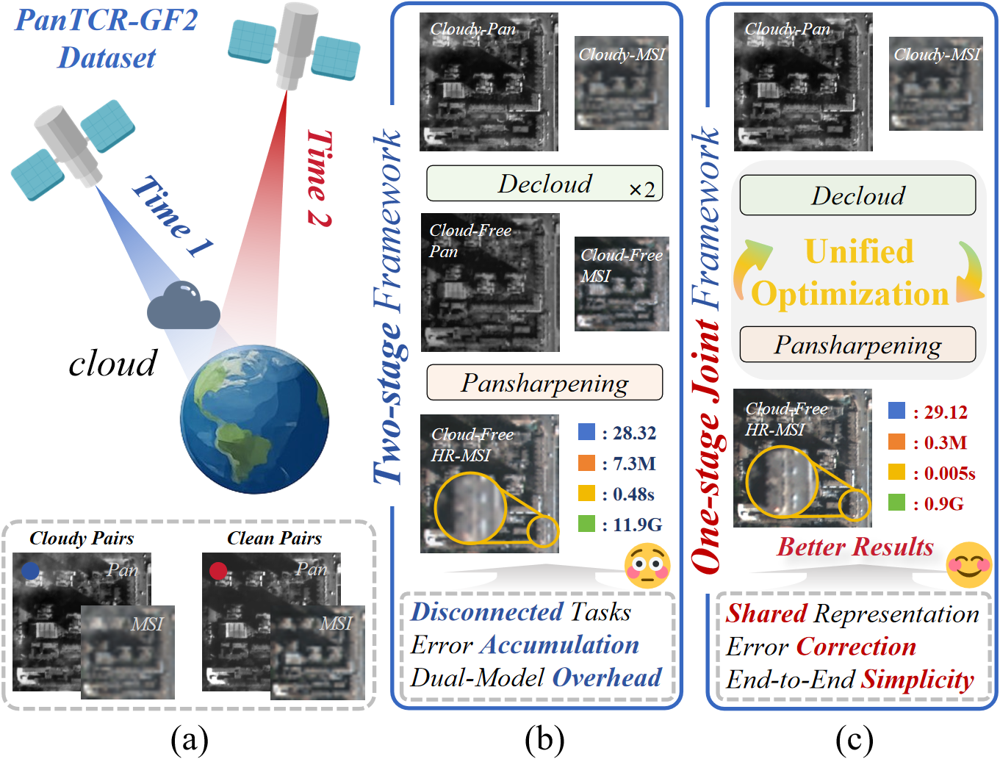
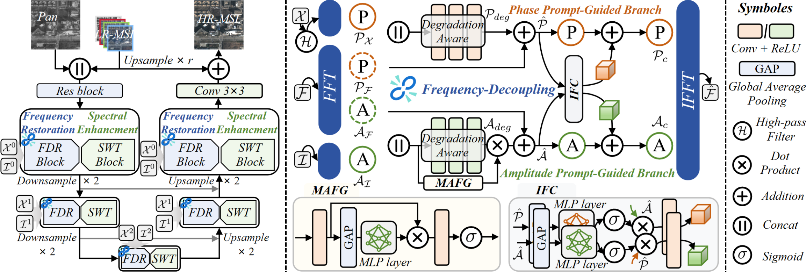
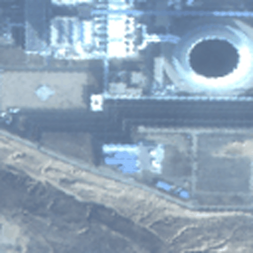
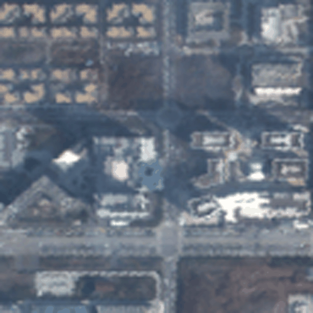
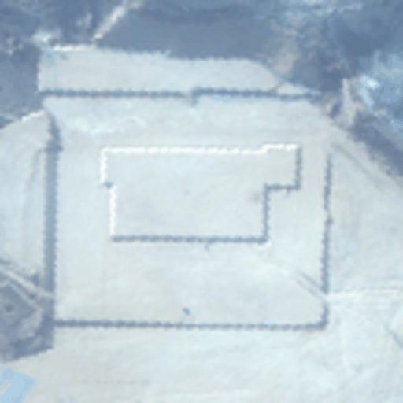
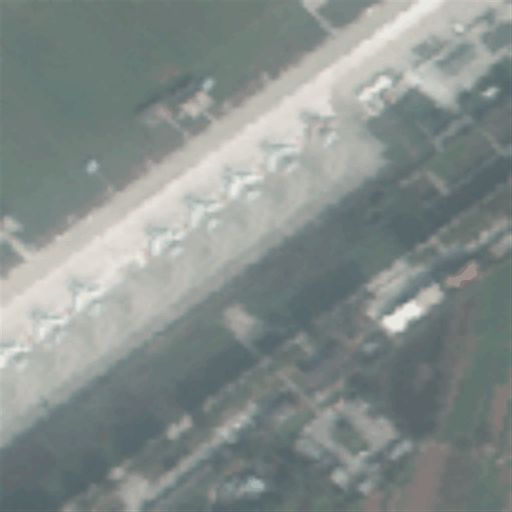

# Pan-TCR
This is the official Pytorch implementation of ["Pansharpening for Thin-Cloud Contaminated Remote Sensing Images: A Unified Framework and Benchmark Dataset"](https://ojs.aaai.org/index.php/AAAI/article/view/37369) which has been accepted by **The AAAI Conference on Artificial Intelligence (AAAI 2026)**!

## Abstract

Pansharpening under thin cloudy conditions is a practically significant yet rarely addressed task, challenged by simultaneous spatial resolution degradation and cloud-induced spectral distortions. Existing methods often address cloud removal and pansharpening sequentially, leading to cumulative errors and suboptimal performance due to the lack of joint degradation modeling. To address these challenges, we propose a **Unified Pansharpening Model with Thin Cloud Removal (Pan-TCR)**, an end-to-end framework that integrates physical priors. Motivated by theoretical analysis in the frequency domain, we design a frequency-decoupled restoration (FDR) block that disentangles the restoration of multispectral image (MSI) features into amplitude and phase components, each guided by complementary degradation-robust prompts: the near-infrared (NIR) band amplitude for cloud-resilient restoration, and the panchromatic (PAN) phase for high-resolution structural enhancement. To ensure coherence between the two components, we further introduce an interactive inter-frequency consistency (IFC) module, enabling cross-modal refinement that enforces consistency and robustness across frequency cues.  Furthermore, we introduce the first real-world thin-cloud contaminated pansharpening dataset (**PanTCR-GF2**), comprising paired clean and cloudy PAN-MSI images, to enable robust benchmarking under realistic conditions. Extensive experiments on real-world and synthetic datasets demonstrate the superiority and robustness of Pan-TCR, establishing a new benchmark for pansharpening under realistic atmospheric degradations.
<div align=center>

</div>


## Architecture

<div align=center>

</div>


## Results Visualization

|                   *Scene 1*                   |                  *Scene 2*                   |                  *Scene 3*                   |                  *Scene 4*                   |                  *Scene 5*                   |
| :-------------------------------------------: | :------------------------------------------: | :------------------------------------------: | :------------------------------------------: | :------------------------------------------: |
|  |  |  |  |  |

## Evaluation on PanTCR-GF2：

Download the PanTCR-GF2 dataset([Baidu Disk](https://pan.baidu.com/s/1bDctANFdxVF55IBYlsVOJQ?pwd=bb73), code: `bb73`).

The process of synthesizing the dataset has been included in the released code. Just run this command:
```python
python ./train.py
python ./test.py
```
The results of several metrics (inference time, PSNR, SSIM, SAM, ERGAS) and reconstruction results will be displayed.

## Environment
```python
python==3.9.0
torch==2.4.1
scikit-image==0.19.0
scikit-learn==1.5.2
numpy==1.23.0
scipy==1.13.1
tqdm==4.66.5
cv2==4.10.0.84
hdf5storage==0.1.4
sewar==0.4.6
timm==1.0.9
hdf5storage==0.19.5
h5py==3.11.0
```
